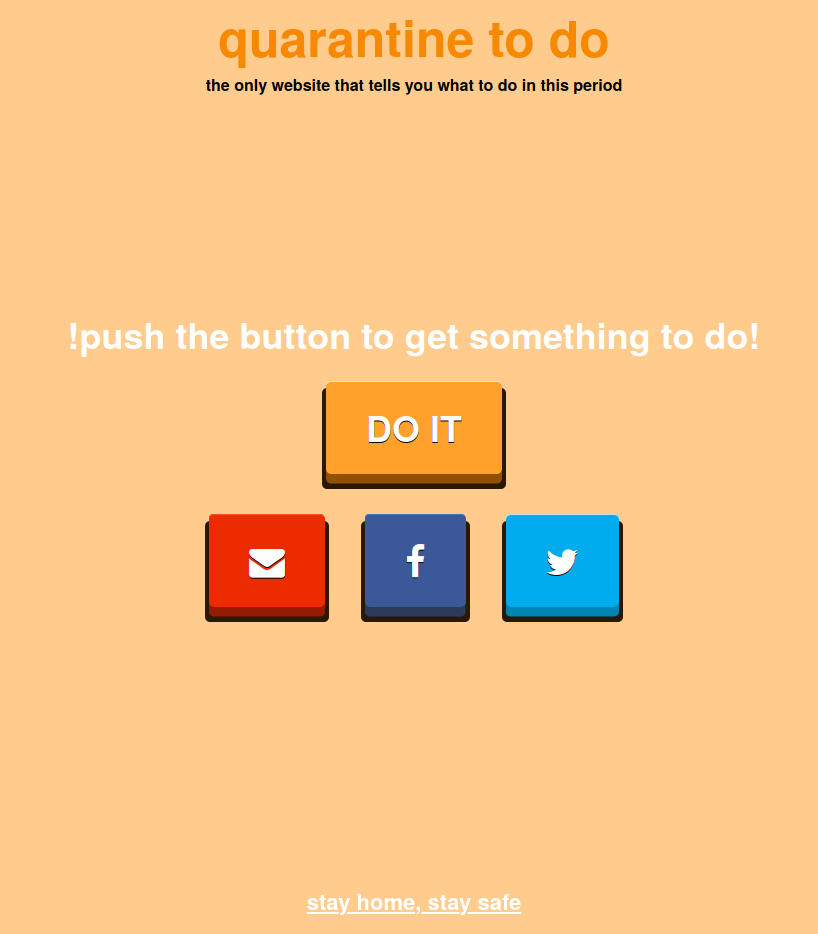

# Quarantine To Do App

The only web site that tells you what to do in quarantine!

The aim of this project is to play with the MEAN stack: Angular2, Typescript, Node, Javascript and some ralated technologies.  
The project is a huge overkill, I know that. 

- `docker-compose` is used to link the frontend, the backend and the mongo db

